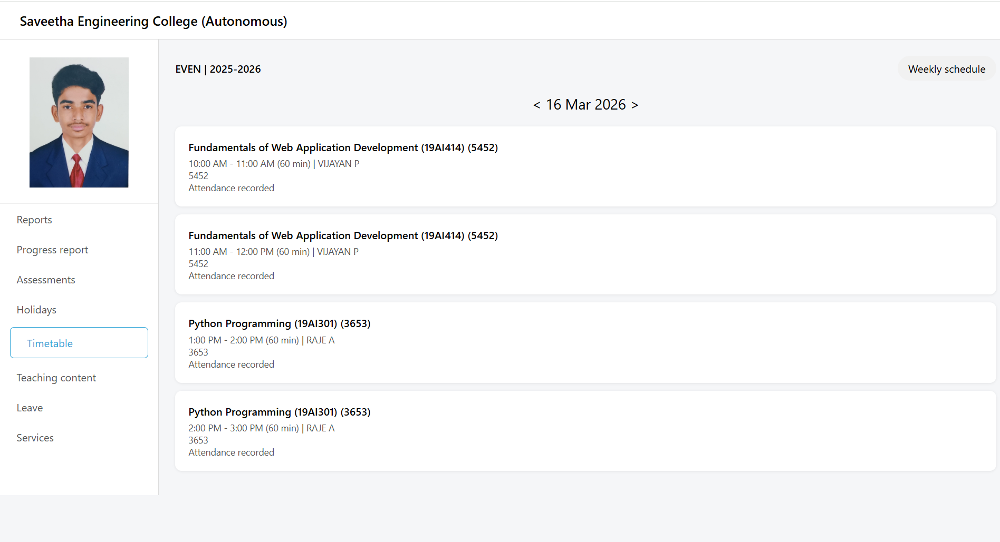

# Ex08 CAMU Schedule using Bootstrap
## Date: 16-03-2026

## AIM:
To design a responsive and visually appealing CAMU Schedule using Bootstrap.

## DESIGN STEPS:
### Step 1:
Clone the repository from GitHub.

### Step 2:
Create Django Admin project.

### Step 3:
Create a New App under the Django Admin project.

### Step 4:
Add the Bootstrap CDN link inside the <head> section.

### Step 5:
Insert a table element with Bootstrap table classes.

### Step 6:
Construct the complete table.

### Step 7:
Add a header/footer displaying copyright information.

### Step 8:
Publish the website in the LocalHost.

## PROGRAM :
```
<!DOCTYPE html>
<html>
<head>
<title>Camu Timetable</title>

<style>

body{
margin:0;
font-family:Segoe UI;
background:#f5f6f8;
}

.header{
background:#ffffff;
padding:15px 30px;
font-size:20px;
font-weight:600;
border-bottom:1px solid #ddd;
}

.container{
display:flex;
}

/* LEFT ICON BAR */

.iconbar{
width:70px;
background:#f0f3f6;
height:100vh;
display:flex;
justify-content:center;
padding-top:20px;
}

.home{
background:#2fa4d7;
width:45px;
height:45px;
border-radius:12px;
display:flex;
align-items:center;
justify-content:center;
color:white;
font-size:22px;
}

/* SIDEBAR */

.sidebar{
width:240px;
background:white;
border-right:1px solid #ddd;
}

/* LOGO SECTION */

.logo{
text-align:center;
padding:20px;
border-bottom:1px solid #eee;
}

.logo img{
width:150px;
}

/* MENU */

.menu a{
display:block;
padding:12px 25px;
text-decoration:none;
color:#555;
}

.menu a.active{
border:1px solid #2fa4d7;
border-radius:6px;
margin:5px 15px;
color:#2fa4d7;
}

/* MAIN */

.main{
flex:1;
padding:25px;
}

.toprow{
display:flex;
justify-content:space-between;
align-items:center;
}

.weekly{
background:#f1f1f1;
padding:8px 16px;
border-radius:20px;
}

.semester{
font-weight:600;
}

/* DATE */

.datebar{
text-align:center;
font-size:22px;
margin:20px 0;
}

/* CARDS */

.card{
background:white;
padding:20px;
margin-bottom:12px;
border-radius:10px;
box-shadow:0 1px 4px rgba(0,0,0,0.08);
}

.subject{
font-weight:600;
margin-bottom:5px;
}

.time{
color:#555;
font-size:14px;
}

</style>
</head>

<body>

<div class="header">
Saveetha Engineering College (Autonomous)
</div>

<div class="container">


<div class="sidebar">

<div class="logo">

</div>

<div class="menu">
<a href="#">Reports</a>
<a href="#">Progress report</a>
<a href="#">Assessments</a>
<a href="#">Holidays</a>
<a class="active" href="#">Timetable</a>
<a href="#">Teaching content</a>
<a href="#">Leave</a>
<a href="#">Services</a>
</div>

</div>

<div class="main">

<div class="toprow">
<div class="semester">EVEN | 2025-2026</div>
<div class="weekly">Weekly schedule</div>
</div>

<div class="datebar">
< 16 Mar 2026 >
</div>

<div class="card">
<div class="subject">Fundamentals of Web Application Development (19AI414) (5452)</div>
<div class="time">10:00 AM - 11:00 AM (60 min) | VIJAYAN P</div>
<div class="time">5452</div>
<div class="time">Attendance recorded</div>
</div>

<div class="card">
<div class="subject">Fundamentals of Web Application Development (19AI414) (5452)</div>
<div class="time">11:00 AM - 12:00 PM (60 min) | VIJAYAN P</div>
<div class="time">5452</div>
<div class="time">Attendance recorded</div>
</div>

<div class="card">
<div class="subject">Python Programming (19AI301) (3653)</div>
<div class="time">1:00 PM - 2:00 PM (60 min) |  RAJE A</div>
<div class="time">3653</div>
<div class="time">Attendance recorded</div>
</div>

<div class="card">
<div class="subject">Python Programming (19AI301) (3653)</div>
<div class="time">2:00 PM - 3:00 PM (60 min) | RAJE A</div>
<div class="time">3653</div>
<div class="time">Attendance recorded</div>
</div>


</div>

</div>

</body>
</html>

```

## OUTPUT:



## RESULT:
A responsive and visually appealing CAMU Schedule web page using Bootstrap is designed successfully.
